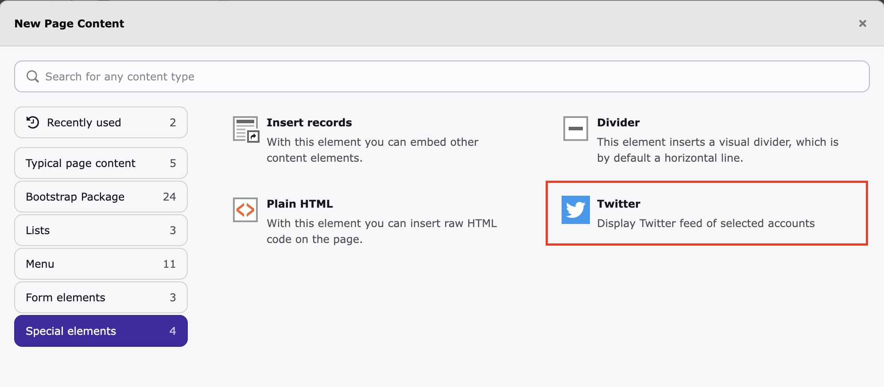

<div align="center">


# TYPO3 extension `xima_twitter_client`

[](https://extensions.typo3.org/extension/xima_twitter_client)
[](https://packagist.org/packages/xima/xima-twitter-client)

</div>

This extension uses the Twitter/X API v2 to import and display tweets. It provides a scheduler command for automated imports and a content element for frontend display.



## Requirements

To use the Twitter API, you need a developer account at [developer.twitter.com](https://developer.twitter.com/). Register your application and obtain:

* API Key (Consumer Key)
* API Secret (Consumer Secret)
* Access Token
* Access Token Secret

## Install

### Composer

```bash
composer require xima/xima-twitter-client
```

### TER

[](https://extensions.typo3.org/extension/xima_twitter_client)

Download the zip file from [TYPO3 extension repository (TER)](https://extensions.typo3.org/extension/xima_twitter_client).

## Setup

### 1. Add Site Set

Add the extension's site set to your site configuration (`config/sites/<your-site>/config.yaml`):

```yaml
sets:
- xima/xima-typo3-twitter-client
```

This automatically includes the TypoScript and PageTSconfig.

### 2. Configure API Credentials

Add the credentials to your extension configuration (e.g., in `additional.php`):

```php
$GLOBALS['TYPO3_CONF_VARS']['EXTENSIONS']['xima_twitter_client'] = [
    'api_key' => 'your-api-key',
    'api_secret' => 'your-api-secret',
    'access_key' => 'your-access-token',
    'access_secret' => 'your-access-token-secret',
    'image_storage' => '1:Images/Twitter',
];
```

### 3. Create Account Records

1. Create a new SysFolder and enable the "Twitter" module
2. Add a new **Account** record inside this folder
3. Enter the Twitter username you want to fetch tweets from
4. Configure the maximum number of tweets to fetch

## Usage

### Import Command

Fetch tweets from all configured accounts:

```bash
vendor/bin/typo3 twitter:fetchTweets
```

#### Command Options

| Option | Description |
|--------|-------------|
| `--account`, `-a` | Fetch tweets for a specific account UID only |
| `--dry-run` | Validate configuration without fetching tweets |
| `-v` | Verbose output with detailed error messages |

#### Examples

```bash
# Fetch tweets for all accounts
vendor/bin/typo3 twitter:fetchTweets

# Fetch tweets for a specific account
vendor/bin/typo3 twitter:fetchTweets --account=5

# Validate configuration only
vendor/bin/typo3 twitter:fetchTweets --dry-run

# Verbose output for debugging
vendor/bin/typo3 twitter:fetchTweets -v
```

### Scheduler Task

You can set up the import command as a scheduler task for automated imports.

### Content Element

Add the **Twitter** content element to any page to display the imported tweets:


## Configuration

### Site Settings

Override the default settings in your site configuration (`config/sites/<your-site>/settings.yaml`):

```yaml
plugin:
    tx_ximatwitterclient:
        settings:
            maxItems: 10
```

### Extension Configuration

| Key | Description | Example |
|-----|-------------|---------|
| `api_key` | Twitter API Key | |
| `api_secret` | Twitter API Secret | |
| `access_key` | Twitter Access Token | |
| `access_secret` | Twitter Access Token Secret | |
| `image_storage` | FAL storage path for downloaded images | `1:Images/Twitter` |

## Troubleshooting

### API Authentication Errors

Ensure all four API credentials are correctly configured. Use the `--dry-run` option to validate your configuration:

```bash
vendor/bin/typo3 twitter:fetchTweets --dry-run
```

### Image Storage Errors

Make sure the configured `image_storage` path exists and is writable. The path should be a valid FAL combined identifier (e.g., `1:Images/Twitter`).

### Rate Limiting

The Twitter API has rate limits. If you encounter rate limit errors, reduce the import frequency or the number of tweets fetched per account.

## License

This project is licensed under [GNU General Public License 2.0 (or later)](LICENSE.md).

## Contribute

This extension was made by Maik Schneider. Feel free to contribute!

Thanks to [XIMA](https://www.xima.de/)!
